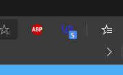
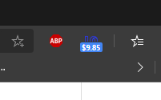

# Unbabel-Chrome-Extension

Shows available tasks aswell as current balance in Chrome Extension Bar.

# What is Unbabel?

Unbabel is an artificial intelligence-powered human online translation platform. Workers from the community around the world can translate for Unbabel via the Web Dashboard or the Mobile App. 

# What does this extension do?

The extension calls the official (mobile) Unbabel API with your credentials to check your balance as well as the number of available tasks for you.

If you are just browsing around, the extension will show the number of tasks currently available. 
If you are already on the Unbabel Website however, the extension will show your current balance, so that you can keep track of your current earnings while translating, without having to return to the main dashboard to check.

# Additional notes

This extention is not affiliated nor endorsed by Unbabel or any of its partners. 

I created this extension out of personal need, because available tasks are sometimes low, and always having a task count in your browser allows you to notice new batches of tasks more quickly. 